> Pandoc 转的，凑活看吧:clown_face:（仓库里有pdf和tex源码）

# 基于头颈角度检测的计算机视觉交互式颈椎病预防系统

    张丁夕     林孟颖     陈卓勋     王航     翟伯灵     郑天羽
  (中国科学院大学   北京   100049)

​	随着人们操作电脑、手机、平板电脑等电子设备的时间越来越长,颈部需要长期保持固定姿势,大部分人也缺乏对颈部的锻炼,颈部出现疼痛等症状的现象越来越多,颈椎病的发病率越来越高且越来越年轻化。市场上现有的颈椎病防治产品多是针对用户颈部出现疼痛、不适后的缓解和治疗,而不是从预防的角度去改善用户的用颈习惯来避免颈部不适的出现。而大部分预防产品也具有成本高昂，技术复杂的缺点。在焦点小组和问卷采访调查的基础上，本文设计了一款基于计算机视觉技术，通过实时监测头颈角度来提取用户颈部姿态，并及时提醒用户纠正不正确姿态，同时配备交互式游戏引导用户科学活动锻炼颈椎的系统，不需要配备任何其余设备，在本地电脑即可实时运行，具有简易便携，用户友好的特点。系统共分为三个主要模块，基于LightweightOpenpose的姿态检测模块，生成视觉与听觉反馈的反馈提醒模块，以及趣味引导用户根据专业颈椎放松操锻炼的游戏模块，三大模块进程共同协作，相互通信。为了检验该系统的有效性和优点，研究邀请了55位受试者对系统进行评估测试，验证该系统能帮助用户缓解颈椎不适症状，养成良好的用颈习惯，并且游戏化的方式能有效帮助用户坚持锻炼活动颈椎。

**关键字:**  颈椎病预防，姿态检测，Lightweight Openpose，游戏化，互动引导，人机交互

    Interactive Computer Vision Cervical Spine Prevention System Based on
Head and Neck Angle Detection
    Dingxi Zhang, Mengyin Lin, Zhuoxun Chen, Hang Wang, Boling Zhai, Tianyu Zheng
    (University of Chinese Academy of Sciences, Beijing 100049, China)

As people spend more and more time operating electronic devices such as computers, mobile phones, and tablet computers, their necks need to be kept in a fixed position for a long time. Most of the existing cervical spondylosis prevention products on the market are aimed at relieving and treating the pain and discomfort in the neck, rather than considering the neck habits of the user from a preventive perspective to
avoid neck discomfort. Most prevention products are also costly and technically complex. Based on focus groups and questionnaires, this paper designs a system based on computer vision technology, which extracts the user's neck posture by monitoring the angle of the head and neck in real-time and provides timely feedback to remind the user to correct the incorrect posture, as well as an interactive game to guide
the user in scientific activities to exercise the cervical spine. It is simple, portable, and user-friendly. The system is divided into three main modules, a posture detection module based on Lightweight Openpose, a feedback reminder module that generates visual and auditory feedback, and a fun game module that guides the user to exercise according to professional cervical relaxation exercises. To verify the effectiveness and benefits of the system, we invited 55 subjects to evaluate the system and found that it helps users to alleviate cervical discomfort and develop good neck habits and that the gamified approach is effective in helping users to stick to the exercise and move their cervical spine.

**Keywords:** Cervical spine prevention, Posture detection, Lightweight Openpose, Gamification, Interactive guidance, Human Computer Interaction

## 引言

21世纪，当智能手机占据了我们生活大部分时间，颈椎病就如近视眼一般，成为了影响我们健康生活的常见病之一。近年来，电脑办公成为我们的日常，随着久坐电脑而来的还有颈椎病。颈椎病（cervical
spondylosis）又称为"颈椎综合征"。是由于颈椎椎间盘退行性改变及其继发的颈椎组织病理改变刺激或（和）压迫颈神经根、椎动脉、脊髓和颈部交感神经等而引起的一系列临床症状和体征[@赵定麟2001现代颈椎病学]。在2016年世界卫生组织公布的\"全球十大顽疾\"中，颈椎病处于第二位。而在我国，颈椎病的发病率约为17.3%，而中国约有1.5-2亿人患有颈椎病。而且最近几年颈椎病已经趋向年轻化，越来越多的年轻人颈椎出现问题[@本刊综合2017职业亚健康之颈椎病]。本研究团队进行的名为《你的颈椎还好吗》的问卷也同样显示了类似的结果，在收到的以大学生为主要群体的77份有效问卷中，超过一半的人每日电脑办公时间超过10h，很大一部分人的颈椎已经出现了不适症状，并且绝大数人没有自觉活动放松颈椎的习惯。同时由于颈椎病是一种慢性病，当出现症状时再去治疗康复的手段不如针对致病因素从根源上抑制它，由此设计针对颈椎病的预防措施非常有必要。

根据Singh团队的一项研究统计，颈椎病的最主要的致病因素就是长期姿势不当导致的颈椎慢性劳损[@singh2014risk]，结合我们的问卷调查结果也显示，绝大部分人无法意识到自己已经长时间处于不当姿势的颈椎受力状态。因此一种预防颈椎病的有效的方式就是通过实时监测用户颈部姿态并在姿势不当时及时提醒用户纠正。近年来，在监测用户颈部姿态有不少研究成果，采用了各类技术对姿势进行估计。J
Lai和 C
Luo则提出了基于声波测距的人体姿势估计系统。该系统利用配备麦克风和扬声器的可穿戴设备，声波被用来估计每对可穿戴设备之间的距离，然后这些设备的二维结构被重建为人体姿势的估计。该系统的动作识别准确率为
97.5%，但存在的问题是穿戴设备的舒适度不高，且容易受到环境干扰[@lai2021acousticpose]。Jeong等在蓝牙耳机中集成了三轴传感器，并基于最小二乘正交距离拟合的方法实现颈部运动角度的跟踪，通过处理传感器获得的点云数据，系统可以检测出头部的前后移动，左右偏转和对角线移动等行为[@jeong2011human]。
李思雨团队提出的基于加速度传感器的头颈部运动采集模块以及基于人工智能的头颈部运动识别模块组成的穿戴式颈椎病预防系统，可以识别头颈部姿态,准确率达到97.51%
[@李思雨2020基于人工智能的穿戴式颈椎病预防系统]。S
Bei团队提出的基于深度传感器的颈部姿态检测则需要专门的深度相机来分析用户头部的具体三维运动[@8284904]。基于各类传感器检测的产品准确度较高，但外设成本都比较高，并且用户的舒适度和体验感不高，难以实现大范围推广。H
Lee团队设计的基于手机加速度传感器，基于手持手机的角度假设估计等方法实现了简单容易实现，准确度也有保证，但是检测仅限于用户使用手机时的测量[@2013Smart]，并不能解决久坐于电脑前的用户的问题。

基于本团队的焦点小组和问卷调查结果，约80%的用户都更加倾向于一款简易便携，操作简单，无需佩戴外设的颈椎病预防产品，所以尽量减少包含传感器相关的外设设备佩戴，可采用计算机视觉技术处理用户图像来解决。同时在反馈方式上，鉴于考虑到用户个体差异性，需要提供多种方式的反馈提醒消息。为了从更加科学专业的方式预防颈椎病，团队在针对相关医学专业人士的采访中得知，预防用户错误颈部姿势同时辅以定期引导用户活动锻炼颈椎将取得更加显著科学的效果。传统的颈椎病物理防治手段如麦肯基疗法[@傅惠兰2013腹针配合麦肯基疗法治疗颈型颈椎病疗效的临床随机对照研究]和颈椎康复操[@朱立国2015颈椎康复操]指导用户完成一系列颈部头部运动，在长期坚持下具有良好地缓解用户颈椎疼痛的效果，虽然成本较低动作简单，但是较为枯燥，难以长期坚持。

<figure>
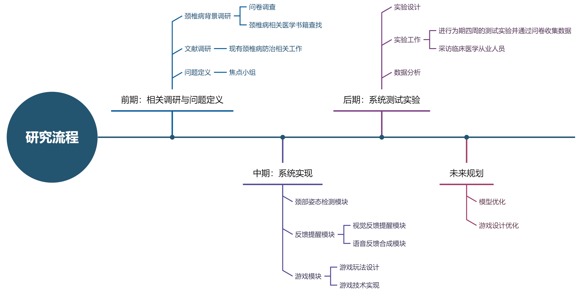
<figcaption>整体研究流程</figcaption>
</figure>

因此本文实现了一个颈椎友好的系统：其通过基于计算机视觉监测颈椎姿态，实时给予提醒和反馈，并使用用户姿态参数进一步控制游戏模块，引导用户锻炼颈椎，系统相关代码均开源在<https://gitee.com/cassie_lin/pose_eval>中，后期模型优化的代码可见<https://github.com/Cassie-Lim/pose_eval>做出了具体如下贡献：

-   基于焦点小组研究与问卷采访结果，设计了一款基于纯计算机视觉技术进行姿态分析，包含多种反馈方式和交互式游戏的颈椎病预防系统，具有用户友好，成本低廉，操作简单，可自定义，效果显著等特点。

-   本文提出了一种简单有效的单目颈椎姿势测定算法，引入校准模块，在利用Lightweight
    Openpose框架标定出关键点后，利用关键点之间几何的角度和长度判定出颈椎的具体姿态，巧妙将三维的动作化为几何指标分类，利用简单的算法便取得较好的结果。同时也极大地提升了程序性能，在CPU上也能达到实时检测的效果。

-   邀请55名受试者对我们系统进行了为期4周的测试实验，同时采访了四位临床医学专业的从业者和学生评估本系统并提出指导性建议，验证了系统的有效性，进一步优化系统设计，为颈椎病预防产品提出了新思路。

## 相关工作概述

### 采用计算机视觉技术的姿态分析

对人体的姿态进行分析时，计算机视觉技术是一种简单高效的方式。Jaimes的工作基于用户自定义动作和分析图像中用户轮廓的方法，实现了对用户希望监测的姿态的时长统计，并在本地给出报告[@jaimes2005sit]。
系统只分析轮廓形状的几何特征并分辨出用户指定的动作，所需要的计算资源较少，同时生成本地报告的方式也保护了用户隐私。Tanaka等为了检测用户错误姿势并做出提醒，利用OpenCV自带的面部识别库在桌面端
实现了头部姿态检测，使用带有加速度传感器的智能眼镜并结合低通滤波、支持向量回归等方式
在移动设备端实现了头部角度检测，并在IOS设备上实现了有效的用户提醒和反馈机制，研究了其效果[@tanaka2015nekoze]。
由于智能眼镜能带有加速度传感器检测角度，可以得到较为精确的结果。但是近年来智能眼镜的应用并不普及，较少人群拥有智能眼镜，可能导致此系统实际部署量较少。另外，在此工作表明，为了达到更好的提醒效果以保证健康，提醒的方式应当醒目。 Lee等提出了Smart Pose，基于用户头颈角度和手持手机的角度有一定的相关关系的假设，利用手机加速度传感器获取的手机角度间接估计用户头部姿势，并以Android系统服务的形式实现了头部角度估计[@lee2013smart]。这种相关关系的假设较为简单，实现起来速度较快，消耗的资源较少，在Android系统中作为系统服务可以后台运行。但其假设在一些情况下不成立，可能导致系统鲁棒性不高。Lawanont等改进了Lee等的工作：引入了面部识别并计算手机和人脸间角度的方法，结合了手持手机角度和面部相对于手机的角度，
更精确地估计了用户的头部实际角度[@lawanont2015smartphone]。其检测人脸和手机整体的角度的方法如下：检测眼睛和嘴分辨占据的矩形框大小，在用户上下偏头的时候，前置摄像头获取的图像中两个矩形框占据的大小的比例会发生变化，程序据此根据经验公式估计角度。

### 人体姿态检测框架及应用

随着深度学习技术的发展，一些高效完善的姿态检测框架逐步步入人们视线，可为使用者提供实时准确的人体框架标注，带来极大的便利。于是一些工作便是基于能够提取图像中人体关键特征点位置的模型以进行姿态检测。
这些提取人体框架的模型包括OpenPose[@cao2017realtime]和BlazePose[@bazarevsky2020blazepose]等。
基于BlazePose，Kapoor等将提取出的关键点作为输入，构建神经网络用机器学习的方法将坐姿分为好坏两类。
以达到实时分类的效果。这样的方式能够挖掘数据内部的联系，避免单一判定标准的鲁棒性不足的缺点，但是可解释性不足。Roig等人通过检测面部确定鼻子的位置，从而实现与设备无接触交互[@roig2016robust]。在检测鼻子位置的基础上，Salinas等检测了低头、仰头、偏头、转头等动作，能够反映头颈总运动量的50%到64.5%的范围[@salinas2021camera]。一些工作利用定制的神经网络，可以提取人体上部图像或者视频的特征，并直接对头颈的角度进行分类。Kulikajevas等构建神经网络，以视频序列为输入进行角度分类[@kulikajevas2021detection]。
这样的方式保留了帧之间的关联，但是无法很好量化角度数值，难以应用于交互动作。一些模型所需要的计算量较大，难以达到实时的效果。

前人工作对本工作有一定启发。若直接借助神经网络以端到端的方式对角度进行分类，得到的角度粒度较粗，不利于实时交互。可以用两步的方法实现角度检测：

- 先检测出图像中人体的各个特征点，再根据特征点进一步解析角度。系统可根据用户的个体差异配置系统的参数，利用合理的假设简化系统设计，以降低资源消耗量，结合模型优化的方法，在计算能力较低的设备上也达到实时的效果。系统不只是局限于单一的错误动作检测和提醒，更进一步，应通过交互的方式实现拉伸动作引导的功能，以更好帮助用户预防颈椎病。
- 在交互方面，应当有较为醒目的提醒方式，避免用户忽视提示信息并继续以错误姿势工作的情况。

## 焦点小组

为探究颈椎病的致病因素及目标群体关于颈椎健康的具体需求、明确系统设计方向，本研究组织了一次焦点小组访谈。八位属于不同年龄段（20-68岁）、来自典型长期伏案工作或生活环境的目标用户和两位临床医学从业者（分别在骨科和脊柱外科）受邀加入焦点小组。八位目标用户平均每天会保持5小时以上的伏案时间，一般用于在电脑上学习、办公或娱乐。

研究者已在会前阐明研究目标是帮助颈椎状态健康或患轻度颈椎病（无器质性变化）的人群预防、治疗颈椎病。明确定义目标群体后，研究者组织八位目标用户分别思考并分享自己平时如何保护、锻炼颈椎以及对现有颈椎病防治产品的看法。接下来，研究者邀请两位临床医学从业者讲授颈椎病的致病因素，最后收集所有组员关于本系统的预期功能。本次会议的所有内容以录音方式记录，以供后期进一步分析和讨论。

大部分目标用户都表示平时不会自觉活动放松颈椎，只有感觉到不适时才会调整一下坐姿及颈部姿态，"工作的时候一晃几个小时就过去了，经常没意识到颈椎已经长时间处于不当姿势"，一位组员这样说。关于市面上现有的颈椎保护产品，用户表示普通的护颈枕基本没有效果，甚至影响工作效率，有质量保证的颈部按摩仪则价格较贵，有些自重较沉的颈椎仪还会对颈椎健康造成负面影响。"很不习惯学习的时候戴个枕头在脖子上......想过买颈椎按摩仪，但是好多购买者都说是智商税，还有一些按摩仪爆炸的负面新闻，更不敢用了"，一位组员担忧地说。

两位临床医学从业者表示，颈椎病是由于颈椎椎间盘退行性改变及其继发的颈椎组织病理改变引起的一系列临床症状和体征，最主要的致病因素就是长期姿势不当导致的颈椎慢性劳损。"作为典型的慢性病，颈椎病最有效的防治手段就是及时提醒用户活动放松颈椎，避免长时间的椎间盘压迫"，一位医生解释道。目前医学上针对早期颈椎病的物理防治手段包括麦肯基疗法和颈椎康复操，其有效性已经过数十年的实践检测，但缺乏趣味性，患者早期往往又不给予足够重视，很难长期坚持。

焦点小组成员均对本研究表示很高的期待。大部分组员表示，希望系统可以在不干扰正常工作生活的前提下，即时监测颈椎状态，帮助用户提高个人颈椎健康意识。此外，多数组员希望可以无需佩戴外设。"如果可以做成一个应用软件，像微信那样用语音或者通知弹窗的方式提醒我们就更好了"，一位组员这样说。两位临床专业从业者表示，希望系统可以提供一种兼具有效性和趣味性的引导锻炼手段，比如设计一款单机游戏，以培养用户长期坚持活动颈椎的习惯。

基于本次焦点小组会议得出的结论和前期背景、相关工作调研，研究团队推断本系统需具备监测颈椎姿态、及时提醒用户和引导锻炼颈椎功能，且需尽可能在成本和设备方面减轻用户负担。同时，本系统引导用户锻炼颈椎的方式需兼具有效性和趣味性。为此，本研究决定结合康复治疗疗法、人机交互技术、计算机视觉技术，在手机、电脑端分别以App和程序形式实现一款操作简单、成本低廉、效果显著、且提供自定义选项的颈椎病监测防治系统，使用户可以仅依靠手机、电脑上的普通单目相机，无需额外佩戴外设，就可以方便地实现颈部角度监测和错误姿势检测超时提醒，解决用户长时间错误姿势对颈椎造成伤害的问题；此外，系统兼有交互控制游戏场景帮助用户活动颈椎、预防颈椎病，使锻炼过程更富趣味性，以提升复健动作的质量和效果。

## 系统设计

### 颈部姿态检测模块设计

#### 姿态检测基本原理

2D人体姿态检测即从图片或者视频中识别出人体关键点以及部位，并利用之重构出人体基本骨架，用以表达肢体运动的过程
[@Deepcut]。

<figure>
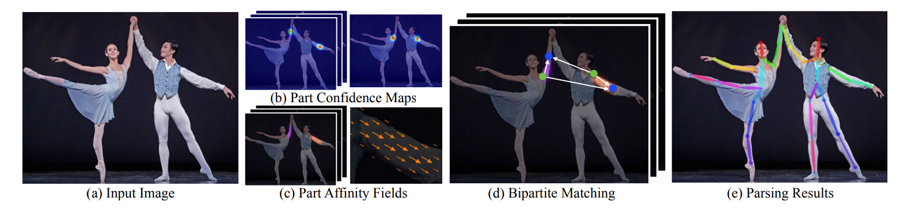
<figcaption>人体姿态检测流程</figcaption>
</figure>

CMU感知计算实验室的曹哲等研究者在CVPR 2017中提出了一个经典的人体姿态检测模型Openpose [@openpose]，下以之具体阐释姿态检测的处理流程：如图1所示，将图片输入到CNN模型，得到一组特征图（feature map）；此后CNN网络将进行初步的骨架关键点预估（Part Confidence Maps，又hotmaps）并提取各个关节之间的关联信息（Part Affinity Fields，PAFs）；接着根据PAF信息利用偶匹配算法将同一个人的相邻关节点连接起来；最终利用各关节点连线组装成一个人的整体骨架。

#### 姿态检测模型选择

最初我们选择了上文提及Openpose模型进行初步的人体骨骼特征点标定，但此后意识到该模型在没有高算力支持下推理耗时较久，很难保证较好的实时性，于是我们又改用Intel的Daniil
Osokin在2018年提出的Lightweight Openpose [@lw_openpose]
加快推理速度，其在Openpose的基础上主要做出如下优化：

-   模型骨架的优化：将VGG网络换成了MobileNet，前者参数量大概在138M（million），而后者仅5M左右，这极大程度上加快了推理速度；MobileNet相较于VGG深度较浅，提取的深层信息相应地减少，作者表明仅仅使用MobileNet进行关键点标定的准确度欠佳，于是后续又增加了空洞卷积，其具体的级联结构将在下文阐释；

-   权值共享以合并分支：原本Openpose在预测hotmaps和PAFs时使用了两个分支，两个分支的整体结构是一致的，只是最终输出数目有异，如图2中左图所示；而Lightweight
    OpenPose就将两个分支合并，在最后分别采用一个1\*1的卷积核得到两路输出，如图2右图所示，有效减少了参数量以及计算量。

    <figure>
    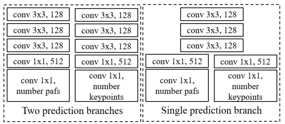
    <figcaption>分支结构</figcaption>
    </figure>

-   小卷积核配合空洞卷积：后期微调参数的时候，Lightweight Openpose将7x7的大卷积核替换成了1\*1， 3\*3，3\*3的小卷积核级联，同时为了保证感受野大小不变，在最后一个卷积核后接上使用dilation=2的空洞卷积，如此可以保证感受野不缩小且能够减少参数量，其卷积模块如图3所示：
    
    <figure>
    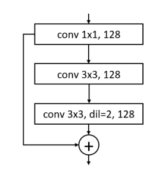
    <figcaption>Lightweight OpenPose卷积模块</figcaption>
    </figure>

#### 颈部姿态的量化计算

得到模型预测的人体骨架特征点后，我们又进一步选出3个特征点（鼻子、脖子、右肩）进行具体的脖颈姿态解算，我们对用户的颈部状态的分析具体分为两个维度，一个是颈部的左右倾斜角度，另一个是颈部的前倾角度。

**（1）左右倾角计算**

左右倾的计算思路较为明确，仅需要计算图4中连接脖子与右肩的向量$\overrightarrow{sn\_vec}$（s:
shoulder; n :neck）
以及连接鼻子与脖子的向量$\overrightarrow{nn\_vec}$（n : nose; n :
neck）的夹角$\theta_{lr}$：

$$\theta_{lr} = arccos(\frac{\overrightarrow{sn\_vec} \cdot \overrightarrow{nn\_vec}}{|\overrightarrow{sn\_vec}||\overrightarrow{nn\_vec}|})$$

<figure>
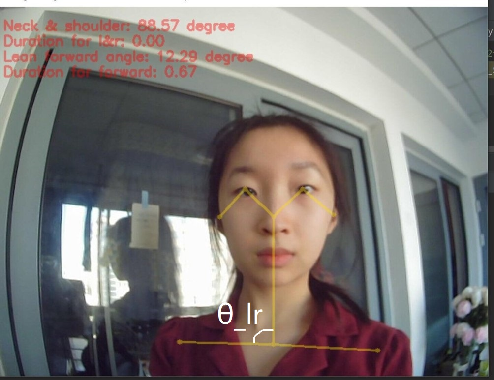
<figcaption>左右倾角示意</figcaption>
</figure>

**（2）前倾角计算**

在前倾的计算中，我们未采用传统基于人脸特征点预测的方式计算俯仰角（如使用DLIB库先标定出六个以上的人脸特征点，进而利用PnP算法准确计算俯仰角、偏航角等），原因是使用模型额外进行人脸特征点标定会预测出全部脸部特征点，存在大量冗余，推理速度相对来说较慢，而我们的系统需要及时给与用户直接的反馈，且还要求姿态检测模块能将实时计算的参数传递给游戏模块，故需要保证良好的实时性。

此外，倘若从侧面采取颈部前倾信息，需要用户额外再配置一个侧视角摄像机，同时用户还需时刻关注自己是否落在侧视角相机的拍摄区域内，给用户带来诸多不变。

基于上述两点考虑，我们采取单目解算的方法计算用户的颈部前倾角。常见的单目深度估算的算法都需要相机内参作为先验值，用户需要查询相关资料或者进行相机标定以获取参数，而我们希望用户无需对这些参数进行配置就可以便捷地使用本系统。但倘若不获取深度信息，而仅仅以脖子长短与某一个阈值比较来衡量用户的前倾状况，显然忽视了用户的个体差异性（用户的脖颈长度可能存在差异）。为解决这个问题，我们引入了校准的子步骤，并设计了一个前倾计算的模块，具体的工作流程如下：

<figure>
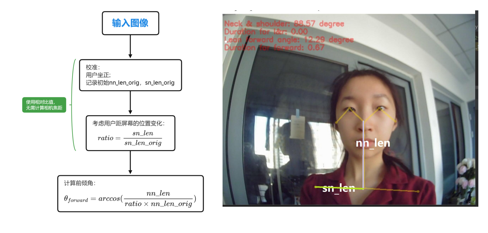
<figcaption>前倾角计算流程</figcaption>
</figure>

首先，需要用户坐正，模块内记录初始脖子长度$nn\_len\_orig$和半肩宽$sn\_len\_orig$，将之作为基准值。

此后，为获知用户的躯干距离镜头的变化情况，计算用户肩宽的放大比例$ratio$，以此将后续得到的长度都换算到用户的初始位置，与基准值作比较，即实际的脖子到鼻子的平面投影有效长度为$\frac{nn\_len}{ratio}$。

最后根据图6所示几何关系计算出前倾角$\theta_{forward} = arccos(\frac{nn\_len}{ratio\times nn\_len\_orig})$。

<figure>
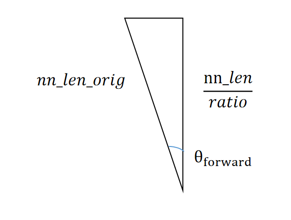
<figcaption>前倾角计算几何关系</figcaption>
</figure>

使用此种方法计算前倾角无需用户额外配置参数，且无需使用模型推理，不会带来大量计算负担。

### 反馈提醒模块设计

当姿态检测模块检测到用户姿势错误时，就应该给予用户及时的反馈。本系统提供了两种方式，分别是听觉和视觉反馈提醒供用户选择。

#### 视觉反馈提醒模块

在视觉反馈提醒中，采用较为直观的弹窗提醒方式，主要通过调用tkinter库，调用弹窗显示的接口函数，在检测到姿势不正确时及时反馈给用户，指示他们回到正确的坐姿上。同时用户也可以通过弹窗自定义设置一些系统中的参数，例如错误姿势保持多长时间进行反馈以及下文游戏模块中的速率参数调节，具体效果如下：

<figure>
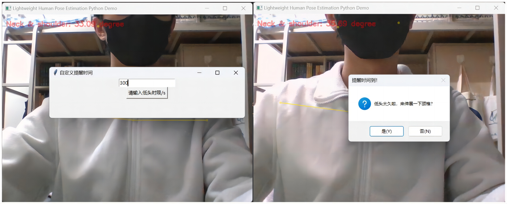
<figcaption>视觉反馈提醒效果图</figcaption>
</figure>

#### 语音反馈合成模块

起初的系统设计中语音合成模块与姿态解算部分是串行的，后来在实际检测中发觉语音合成会耗费大量时间，反而拖累姿态解算模块的计算，于是考虑额外使用一个线程进行语音合成。

在获知了左右倾角、前倾角后，需要有一个线程综合考虑用户左右倾、前倾的情况，进一步决策需要发送何种提醒消息，该步骤耗时不长，故考虑将之与语音合成模块串行。其在每次判断出用户姿态不规范、且持续时间超过某一特定阈值后，会将相应提示信息放到FIFO中，并唤醒语音合成线程。

语音合成线程的实现基于pyttsx3，其是一个基于实现SAPI5文语合成引擎的Python封装库。在检测到消息队列为空时就会主动挂起，避免浪费计算资源，当其被主线程唤醒后就会逐个处理FIFO中的字符串，将之合成为音频。

最终语音合成模块的整体设计如图7所示：

<figure>

<figcaption>语音合成模块示意图</figcaption>
</figure>

### 游戏模块设计

利用姿态检测和语音合成模块，可以有效帮助用户在长时间坐姿工作时保持正确的颈椎姿势。但是长时间的工作依旧会给颈椎带来一些压力与负担，要想真正全面地预防颈椎病，还需要定期进行颈椎的舒缓放松运动，从而放松肌肉，舒展关节，增加肌力。并且颈椎病作为慢性疾病，长期坚持锻炼活动颈椎才能够起到真正的预防效果。所以根据前期的问卷，本文设计了游戏模块以趣味的形式来引导用户坚持进行科学的颈椎锻炼运动。

#### 颈椎锻炼动作设计及对应游戏操作

设计颈椎锻炼动作时，要符合人体一般运动规律和颈椎功能以及颈椎病发病特点，并且尽量简单易学，不受场地和设备等的限制。参考"十一五"国家科技支撑计划项目课题成果------颈椎康复操[@朱立国2015颈椎康复操]，适用于健康人群、颈椎病患者稳定期、康复期人群，在长期坚持锻炼下可以起到放松舒缓颈部肌肉，放松精神的功效。

如下图所示，活动放松颈部肌肉可提取为以下四个有效动作，头部分别缓慢地向上下左右尽量伸展，每次保持5至10秒，慢慢还原，每个方向重复5次，如此可以伸展头，颈，肩部肌肉，有利于防治颈椎病，肩周炎。

<figure>
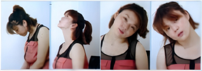
<figcaption>颈椎锻炼动作实例</figcaption>
</figure>

据此，游戏模块的设计目的也应该为引导用户完成这样的动作，可以将用户头部的运动映射为游戏中的主角的移动。为了方便所有年龄阶段的用户都能轻松理解游戏的内容，借鉴了一款非常经典的动作单机游戏------吃豆人的玩法。以吃豆人为主要元素，让吃豆人在地图中前进，避开幽灵并吃完所有金币即可触发胜利机制。头部的上下左右伸展控制主角在地图中上下左右移动。用户无需佩戴任何设备，只需要坐在电脑摄像头前即可与游戏进行交互。

#### 游戏玩法设计

<figure>
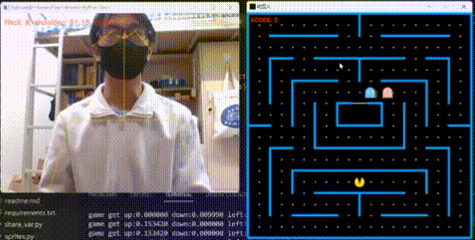
<figcaption>游戏玩法实例</figcaption>
</figure>

根据上文设计的颈椎锻炼动作，设计了如下图所示的游戏地图。吃豆人只能沿着赛道运动，并且当用户保持头部姿态不变时吃豆人才可以持续移动。地图的设计充分考虑了用户需要均匀地向各个方向拉伸颈椎，所以设计成了完全对称的结构，同时只有在行进中收集完所有金币才会触发胜利机制，即历经地图上的每一处，保证了用户在控制吃豆人的行进中完成整套颈椎活动操。在游戏中加入幽灵的角色增加了游戏的趣味性和挑战性，也丰富了游戏内容，用户还可以自定义设置幽灵个数以及移动速率来控制游戏的难度。

#### 游戏技术实现

吃豆人的游戏设计是基于Pygame开源库实现的单机小游戏，通过不同的类来实现角色的不同属性。用户通过摄像头与游戏交互的过程中需要借助上文的姿态检测模块，通过角度判定可以分析出当前用户头部所处的姿态为仰头，低头还是左右偏头，然后利用进程间的通信将这一姿态参数信息传递给游戏模块，从而控制吃豆人在屏幕上的移动。

### 整体系统架构

系统整体架构如下图所示：

<figure>
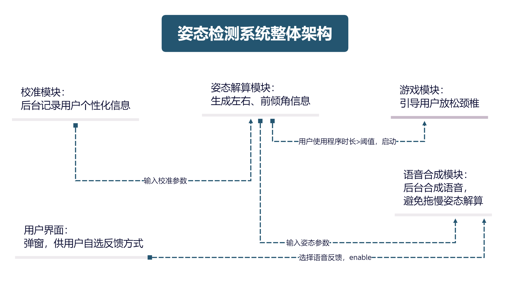
<figcaption>姿态检测系统整体架构</figcaption>
</figure>

首先在校准阶段记录用户的半肩宽与脖颈长度，为后续姿态解算提供初始参数；

姿态解算模块根据当前帧提取的信息以及校准时记录的初始参数计算出用户颈部的左右倾角以及前倾角信息，并将相关数据传递给游戏模块以及语音合成模块（在游戏模式下可选择关闭语音合成模块，以达到更高的同步率）；

语音合成模块另起一线程，以保证姿态计算的实时性，同时采用生产者消费者模型达到语音合成线程和主线程的同步；

游戏模块从姿态解算模块获得用户颈部信息，并将之转化为上、下、左、右的运动序列，控制吃豆人的移动。

正常运行整个程序时首先会在后台启动校准模块，记录用户的个性化信息，然后用弹窗让用户自主选择反馈方式，视觉或者听觉，同时让用户自定义反馈提醒的频率。与此同时校准模块的参数记录完后则传递到姿态解算模块启动整个模型，若选择视觉反馈则直接在进程中调用函数接口即可；若选择语音反馈，则开启语音合成模块进程，实时监测用户颈部姿态并给与及时的反馈。当用户使用程序到一定时长，则会弹窗提醒用户放松活动颈椎，从而开启游戏模块进程，在趣味性游戏中引导用户完成整套颈椎放松运动。

## 实验设计

为了解系统的有效性并进一步优化系统设计，在姿态检测系统整体架构初步搭建好后，本研究采访了一些专业的临床医学从业者，根据他们的建议对系统展开测试和校正，同时邀请了一批用户试用本系统，进行了为期四周的实验，通过整理、分析受试者的使用体验，再次调整各模块的具体参数。

### 受试者

本研究进行了为期四周的实验，共选择了55位健康的普通受试者，年龄均匀分布在18-25、26-50和51-75三个年龄段，以同时满足不同目标群体的需求，其中受试者年龄分布图如下。受试者的选择标准包括：工作或生活环境需要久坐，每天可以保证5小时以上的伏案时间，包括学生、从事科研、写作、财务、打字的工作人员、办公室白领、老年人群体等；目前颈椎处于正常状态，临床上没有颈椎病的症状和体征。

除此以外，本研究采访了两位临床医学从业者（分别在骨科和脊柱外科）和两位临床医学专业学生，邀请他们试用本系统，评估系统的有效性，并对各环节（包括监测、反馈、引导）提出指导性建议。

<figure>
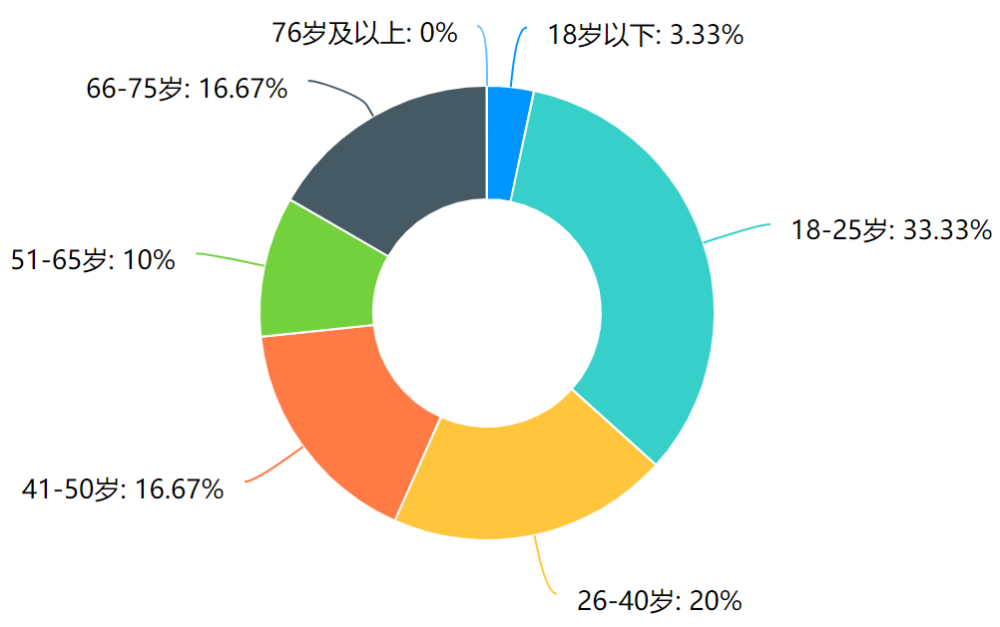
<figcaption>受试者年龄分布图</figcaption>
</figure>

### 实验步骤

实验开始前，研究者首先以腾讯会议的方式集中阐释实验目的，指导所有受试者完成环境的安装，并提醒受试者在身体不适时暂缓使用本系统，以避免无关的身体、心理因素影响实验结果。此外，实验要求受试者在使用本系统时保持摄像头基本正对人体。

实验自变量包括：是否使用本系统、采取何种反馈方式以及采用何种引导锻炼方式；因变量为颈椎病防治效果以及系统交互方式的用户体验。反馈方式包括语音（听觉）、弹窗（视觉）和振动（触觉）反馈，引导锻炼方式包括视频教学颈功操和游戏引导（吃豆人）。

    自变量                            描述
---------- ------------------------------------------------------
   使用情况                 使用本系统或不使用本系统
   反馈方式   语音提醒（听觉）、弹窗提醒（视觉）或振动提醒（触觉）
   引导方式                    视频教学或单机游戏

  : 实验自变量描述

实验要求受试者在第一周不使用本系统，在第二周使用本系统且不进行引导锻炼，在第三、四周分别采用视频教学和游戏引导锻炼方式。此外，该周使用本系统时，周一选择语音反馈方式、周二选择弹窗反馈方式、周三选择振动反馈方式、周四选择语音和弹窗反馈方式、周五选择语音和振动反馈方式、周六选择弹窗和振动反馈方式、周日三种反馈方式同时开放。实验整体流程图如下。

<figure>
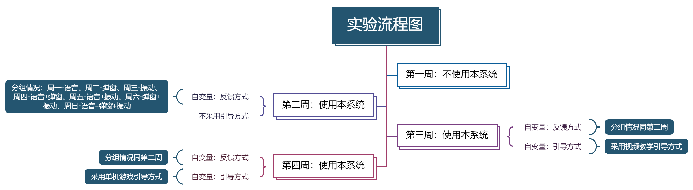
<figcaption>实验流程</figcaption>
</figure>

受试者需持续以天为单位记录颈椎状态和使用感受，同时保证每次系统提醒后10分钟以上的引导锻炼时间（三、四周）。实验结束后，受试者通过比较不同阶段、不同自变量下的颈椎状态，结合使用体验，对本系统进行评估。
除此以外，本研究的采访环节以腾讯会议的方式进行，四位受访者单独进行采访以避免相互影响。采访前研究者已依次引导四位受访者完成环境配置，阐明系统设计目标以及系统使用的注意事项。

### 评估方式

#### 颈椎病防治效果

以不使用本系统的第一周为对照组，受试者通过比较第一周和第二周的颈椎情况，对系统进行打分（A、B、C、D四个等级，分别代表非常有效、有一定效果、基本无效、产生负面效果）。再者，受试者以不采用引导锻炼的第二周为对照组，分别比较第三周、第四周采用同一反馈方式下引导锻炼后的颈椎状态，评估视频教学和单机游戏两种引导锻炼方式的颈椎病防治效果。每位受试者会在一周实验结束后对当周颈椎健康状况进行评估，通过对比健康状况即可对不同方式的防治效果进行比较。

除此以外，鉴于颈椎病的慢性病特性，为进一步检验系统有效性，受试者还需评估是否愿意长期坚持使用本系统（不愿意，不确定或愿意）。

#### 交互方式

关于系统与用户的交互方式的评估包括两个方面：反馈方式和引导锻炼方式。关于反馈方式，受试者需比较同一周内（二、三、四周）采用不同反馈方式时的用户体验，选择对于语音提醒、弹窗提醒和振动反馈三种反馈方式的偏好（可多选），或提出新的反馈方式的建议，并评估反馈的频率是否合适（基本合适、提醒频率较低或提醒频率较高），理想提醒频率以及是否希望可以自定义提醒频率，帮助本研究进一步完善系统设计。

关于引导锻炼方式，视频教学选用的是中国中医科学院首席研究员朱立国提出、获国家级科技进步奖的颈椎康复操[@朱立国2015颈椎康复操]，游戏模块则为上文提到了融合颈椎康复操与吃豆人的动作类单机小游戏。受试者需分别比较第三周、第四周采用同一反馈方式下引导锻炼后的使用感受，评估两种交互方式的用户体验，选择对两种引导方式的偏好或提出新的引导方式建议，并选择对于游戏类型的偏好，帮助本研究进一步设计游戏模块。

## 实验结果

通过对55位受试者进行问卷调查与回访，可以得到如下结论。

**本交互系统能够有效地改善用户颈椎健康状态。**对比用户使用本系统前后的颈椎健康状况可以得出，90%以上的用户认为本系统能够较为有效地缓解颈椎疲劳且愿意长期使用本系统。一些受访者在采访中表示："平时没有注意自己的用颈习惯，总是感觉长时间工作后肩颈非常酸痛。使用这个系统可以及时提醒我纠正无意识的错误姿势，并且还可以定期通过玩游戏来活动放松颈椎，同样的工作时间之后颈椎就没有非常疲劳的感觉了。"

<figure>

<figcaption>系统有效性验证</figcaption>
</figure>

**定期引导用户进行颈椎放松锻炼能更加显著缓解颈椎不适现象。**通过对比第二周不采用引导和第3,4周采用系统引导锻炼的用户反馈发现，超过92%的用户认为定期引导进行颈椎活动操的锻炼能够更好帮助缓解颈椎疲劳，也能在长期忙碌的工作学习中放松精神。

<figure>

<figcaption>引导设计用户反馈</figcaption>
</figure>

**游戏化的引导设计更能帮助年轻用户坚持锻炼，基础视频教学更受中老年群体欢迎。**受试者在第3,4周实验中分别使用视频教学和单机游戏两种引导方式，基于同一颈椎锻炼操原理比较用户体验反馈以及长期使用倾向。41%左右的用户只倾向于游戏引导锻炼方式，16%左右的用户只倾向于视频教学，其余用户期望能同时引入两种引导方式。特别的，87%的中老年用户（40岁及以上）都有选择了视频教学，而94%的年轻用户（40岁以下）都有选择游戏引导。由此，不同年龄阶层对于引导方式有着不同的需求倾向，为满足有颈椎病困扰的不同年龄段用户群体，本系统同时提供了两种引导方式供用户选择。其中在游戏类型相关建议中，绝大多数的用户表示喜欢无需外设的、简单的动作类单机小游戏，表明本设计的游戏类型能够得到大多数用户的认可。一位受访者在接受采访时也表示："小游戏好，比较轻便，工作累了简单放松一下。形式复杂了反而体验不好，而且说实话不是很有必要"。

**听觉反馈方式提醒用户体验感最佳。**根据受试者同一周内对于不同反馈方式时的综合用户体验评估可知，超过四分之三的用户偏好语音提醒这一反馈方式，也有25%的用户选择了视觉反馈方式。一些受试者也表示："听觉反馈的体验感是最好的，不仅可以及时正确地纠正我的姿势，而且不太干扰正常的工作，也不需要佩戴其他设备"。此外，选择语音提醒和其他反馈方式的组合的用户中，超过半数的用户也选择的是语音和弹窗反馈方式。为此，本系统交互方式中的反馈模块选择采用语音提醒和弹窗提醒两种反馈方式的组合。

<figure>
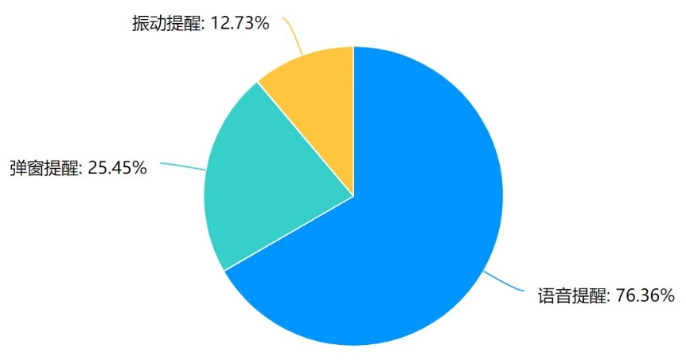
<figcaption>用户偏好反馈方式</figcaption>
</figure>

**提醒频率等参数个体化差异较大，应开放给用户自定义设置。**用户在提醒频率这一参数阈值上的反馈个体性差异较大，在1min/次-10min/次中呈现类均匀分布。当提醒频率过高时可能会干扰部分用户正常工作；较低时不能及时提醒用户纠正从而减弱预防效果。因此此类参数设置让用户自定义设置是最佳的选择，在用户反馈中也可以发现超过94%的用户希望开放自定义参数选项。类似的在游戏模块中运动速率，关卡难度等设置也与个体反应速率和偏好等有较大相关，也为用户提供了个性化设置的功能。

此外，通过对两位临床医学从业者和两位临床医学专业学生的采访可以得出以下结论：第一，颈部姿态检测灵敏度有待进一步优化，目前延迟程度会影响游戏引导方式对颈椎病的防治效果以及用户的游戏体验；其次，游戏机制有待进一步完善，目前游戏中缺乏引导用户缓慢转头的机制，且过于追求速度，但转头比歪头更起到活动放松颈椎的作用，通用颈椎康复操中设计的动作也需在慢速的前提下完成。此外，两位临床医学从业者强调颈椎病防治研究务必"从长计议"，能保证用户坚持使用本系统是成功的关键，可以尝试通过游戏等方式打造一个颈椎锻炼社区，以增加用户粘性。

综上，对用户的调查结果表明了本交互系统的在帮助改善颈椎健康状态方面的有效性，且能带给用户较好的、多样化、个性化的使用体验。同时，受试者反馈和采访结果也表明本研究还需进一步优化颈部姿态检测模块，降低延迟，提高检测的即时性和用户的游戏体验，并进一步优化游戏模块设计。

## 讨论

### 局限

**姿态检测模块延迟较高。**
本系统对在姿态检测模块中对摄像机拍摄数据的实时处理具有一定的延迟，在CPU上可达到26ns，但与其他模块进程共同工作时延迟在100-300ms之间，因此本团队尝试了一下几种方法对姿态检测模块进行优化。

首先，可以尝试更换骨架。目前团队正在探究将模型基本骨架更换为EfficientNet[@tan2019efficientnet]的效果（模型训练仍在进行中），其使用模型复合缩放方法以更好地平衡分辨率、深度和宽度这三个维度，来提高网络的效率和准确率。其主干沿袭了MobileNetV3网络中的InvertedResidualBlock，将激活函数更换为Swish函数，更为关键的是其加入了SE（Squeeze-and-Excitation）模块，其可以自动学习到不同channel特征的重要程度，在感受野不大的情况下作为重要的语义补充。更进一步地，后续我们可尝试将Transformer的处理思路应用于模型骨架，如加入模型Parc-Net的关键模块Parc-block[@zhang2022parc]；Parc-Net通过该模块融合了Vit（Vision
Transformer）和传统卷积模型的优点：Transformer能考虑更多全局和时序信息，且拥有较高的准确度，谷歌团队在2020年将其应用于图像识别，在验证中准确度超过了在测试时使用的所有前沿的传统卷积网络[@vit]；但是卷积网络有相对更小的参数量，且训练时间更短，对于移动段用户更加友好。Parc-Net模型综合了两者的优势，若用其替换本研究的骨架，就无需像Lightweight
Openpose一样使用空洞卷积来扩大感受野，因为Transformer关注了全局信息，本身就有较大的感受野。

其次，对某些加速运算的方法进行了尝试（如模型量化），但由于pytorch量化接口暂不支持empty_strided，具有一定难度。

另外，本系统实际只使用用户上半身的部分关键点，在训练时可以只保留部分label，以提高后续的推理速度。

**游戏设计多样性和互动性待提高。**
目前设计的动作单机游戏整体难度较高，速度也较快，由于检测模块具有延迟，操作体验感还有待提高。同时根据对医学专业人士的采访，需要增加让用户缓慢转头的动作引导，以达到充分锻炼颈椎的目的；打造颈椎锻炼社区，以增加用户粘性。

**平台兼容性不足。**
目前本系统只支持在PC上运行，平台的兼容性有待完善，未来希望将本系统扩展到平板电脑、手机端，能够帮助用户在工作学习更加全面地防治颈椎病，养成良好长期锻炼颈椎习惯。

**颈椎健康状况评估较主观。**
在实验中采用的主要是用户自我反馈机制来评估每周的颈椎状况，并未使用严谨的医学测量手段，得到的评估结果具有一定的主观误差。

  优点                                             缺点
------------------------------------------------ --------------------------------------------
  操作简单，无需任何外设                           只对使用电脑工作的人群生效，平台兼容性不足
  功能全面，包括检测提醒与引导放松                 某些情况下检测延迟较高
  游戏化引导提升趣味性和用户体验感，鼓励长期使用   游戏类型多样性和互动性有待提升
  引导反馈方式选择多样                             颈椎健康状况评估较主观
  用户可自定义参数设置                             

  : 系统优缺点分析

### 贡献

本文实现了一个通过基于计算机视觉监测颈椎姿态，实时给予提醒和反馈，并通过姿态识别控制游戏引导用户锻炼颈椎的完整系统。相较于现有的颈椎病预防系统，本系统只通过计算机视觉技术，即电脑端自带的摄像头即可实现实时的颈椎姿态检测和反馈，不需要额外配备任何其他设备，具有简易便携的特点。在系统中用户可自定义选择纠正错误姿势时的视觉或听觉反馈提醒方式，以及自主设置如最长运动间隙等一系列参数。同时系统采用游戏化的方式引导用户进行颈椎锻炼，设计了一款结合了颈椎康复疗法和人机交互技术的动作单机游戏，使锻炼过程更富有趣味性，提升复健动作的质量和效果，帮助用户养成长期锻炼的好习惯。在整体设计上充分考虑到了本地电脑的计算与负载能力，提高性能与实时性，对于用户硬件没有过多的要求，能够更好地普遍推广。

本研究中一共完成两次问卷调查与专访，通过前期的问卷明确了符合大众需求的设计目标并得到了相关的专业医学指导。在后期实验中也验证了本系统的有效性与趣味性，从姿态纠正与引导用户自身运动缓解两方面同时预防颈椎病，并且游戏引导的方式也更能帮助用户长期坚持锻炼。相信这也能为后续疾病防治产品的研发带来一些启发，游戏化设计和实体交互方式的结合，有助于用户养成好的行为习惯，给枯燥的体验带来更多乐趣，进而促进用户的身心健康发展。

在算法设计上，本文提出了一种简单有效的单目颈椎姿势测定方法，符合奥卡姆剃刀的哲学原理。结合校准模块，借助Lightweight
Openpose框架[@lw_openpose]对关键点进行标定，利用几何的角度和长度判定出各类用户颈椎的具体姿态，巧妙将三维的动作化用几何指标来分类，利用简单的算法便取得较好的结果。

## 结语

本文设计并实现了一个基于头颈角度检测的计算机视觉交互颈椎病预防系统，利用电脑自带的单目相机实时拍摄用户画面，基于Lightweight
Openpose框架与几何算法简单高效地识别颈椎姿态，在用户姿势不当时及时给予个性化提醒反馈，同时以游戏化方式定期引导科学锻炼活动颈椎。整体实验设计中，前期基于焦点小组，文献调研以及问卷调查采访实现以人为本的颈椎病预防系统的基本设计；中期实现了系统中的三大主要模块，并通过进程间通信有机串联起来；后期邀请了各个年龄阶层的受试者开展了为期4周的实验，围绕系统有效性验证，反馈、引导方式偏好等进行了一系列对照实验，最终验证该系统能有效改善用户颈椎健康状况，并且听觉反馈方式以及游戏化引导更能提升用户体验感和用户黏性，系统具有操作简单，用户友好，用户黏着度高，个性化配置丰富，高性价比，效果显著等特点。最后提出了本系统未来的优化方向，可将适用范围从电脑端扩展到手机端、iPad端等，适用更多设备；同时继续优化模型来提高检测灵敏度，解决延迟问题。在电脑办公任务繁重，人们广泛需要颈椎保护的今天，不难预见到我们的产品可以为很多人提供帮助，拥有广阔的市场，也希望该研究能为后续疾病防治产品带来一些启发。

## 致谢

我们向中国科学院大学人机交互课程的田丰老师和孙伟老师表示诚挚的谢意，感谢两位老师给与我们课题的宝贵建议和悉心指导。此外，我们小组6名同学的分工如下：

张丁夕：负责游戏模块设计和论文修改整合工作、摘要及结语撰写

林孟颖：负责姿态检测模块与语音合成模块设计、模型优化与调参

陈卓勋：负责视觉提醒模块设计及文献调研工作

王航：负责前期文献调研、问题定义及焦点小组工作，设计并完成系统测试实验、实验数据分析

翟伯灵：负责前期问卷采访和游戏思路设计

郑天羽：负责背景调研和结果初步整合
